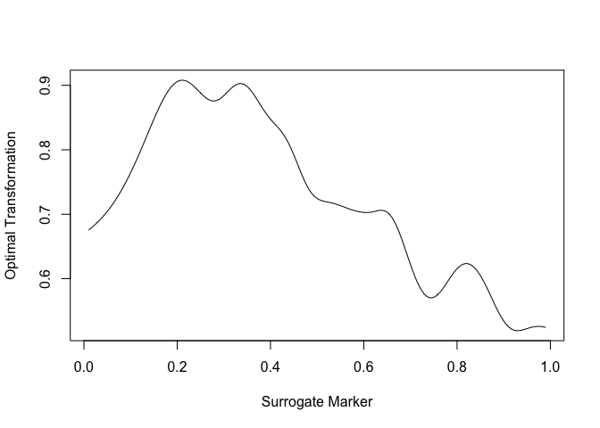

<!-- README.md is generated from README.Rmd. Please edit that file -->
## OptSurrogateSurv: Quantifying the Feasibility of Shortening Clinical Trial Duration Using Surrogate Markers

<!-- badges: start -->
<!-- badges: end -->
The goal of OptSurrogateSurv is to nonparametrically estimate the PTE (proportion of treatment on the primary outcome explained by a surrogate) of an optimally transformation of surrogate marker measured at an earlier time. The primary outcome measured at a later time may be subject to censoring.

## Installation

You can install the released version of OptSurrogateSurv from [CRAN](https://github.com/wx202/OptSurrogateSurv.git) with:

<!-- ``` r -->
<!-- install.packages("devtools") -->
<!-- library(devtools) -->
<!-- devtools::install_github("wx202/OptSurrogateSurv") -->
<!-- ``` -->
    # install.packages("devtools")
    library(devtools)
    devtools::install_github("wx202/OptSurrogateSurv")

## Example

This is a basic example which shows you how to solve a common problem:

``` r
library(OptSurrogateSurv)

# load data
data("sysdata")
# time surrogate is measured
t.0=data.example$t.0
# time primary outcome is measured
t=data.example$t
# observed survival time
xob=data.example$data$xob
# surrogate information at t.0
s.ob=data.example$data$s.ob
# event indicator
deltaob=data.example$data$deltaob
# treatment indicator
aob=data.example$data$aob

# main estimation function
# varind: whether to estimate variance; re:number of replications for resampling
out=pte.survival(xob,s.ob,deltaob,aob,t,t.0,varind=0,re=100) 
# estimated PTE
out$pte.est
#> [1] 0.8413843
# estimated g1
out$g1.est
#> [1] -0.0180641
# estimated g2(s) at equally spaced s point
plot(out$sgrid,out$gs.est,type="l",xlab = "Surrogate Marker", ylab = "Optimal Transformation")
```

 The PTE result indicates that this is a moderate to high surrogate marker in this setting.

## Some explanations

The observable data for analysis consist of *n* sets of independent and identically distributed random vectors {*D*<sub>*i*</sub> = (*X*<sub>*i*</sub>,  *δ*<sub>*i*</sub>,  *S*<sub>*i*</sub>*I*(*X*<sub>*i*</sub> ≥ *t*<sub>0</sub>), *A*<sub>*i*</sub>), *i* = 1, ..., *n*}, where *T*<sub>*i*</sub> = *T*<sub>*i*</sub><sup>(1)</sup>*A*<sub>*i*</sub> + *T*<sub>*i*</sub><sup>(0)</sup>(1 − *A*<sub>*i*</sub>), *C*<sub>*i*</sub> = *C*<sub>*i*</sub><sup>(1)</sup>*A*<sub>*i*</sub> + *C*<sub>*i*</sub><sup>(0)</sup>(1 − *A*<sub>*i*</sub>), *X*<sub>*i*</sub> = *m**i**n*(*T*<sub>*i*</sub>, *C*<sub>*i*</sub>), the primary outcome *Y*<sub>*i*</sub> = *I*(*X*<sub>*i*</sub> &gt; *t*), the surrogate *S*<sub>*i*</sub> = *S*<sub>*i*</sub><sup>(1)</sup>*A*<sub>*i*</sub> + *S*<sub>*i*</sub><sup>(0)</sup>(1 − *A*<sub>*i*</sub>) is only observed for those with *X*<sub>*i*</sub> &gt; *t*<sub>0</sub>.

The function outputs estimates (and standard error estimates if indicated) of *P**T**E* = *Δ*<sub>*g*<sub>*o**p**t*</sub>(*S*)</sub>/*Δ*, the proportion of treatment effect explained quantity based on the ratio between the treatment effect on the optimal transformation of the potential surrogate marker and the treatment effect on the primary outcome, where *Δ* is the treatment effect on the primary outcome *Y*; *Δ*<sub>*g*<sub>*o**p**t*</sub>(*S*)</sub> is the treatment effect on the optimal transformation of the surrogate *g*<sub>*o**p**t*</sub>(*S*)=*I*(*T* ≤ *t*<sub>0</sub>) *g*<sub>1, *o**p**t*</sub> + *I*(*T* &gt; *t*<sub>0</sub>) *g*<sub>2, *o**p**t*</sub> ≈ *I*(*T* &gt; *t*<sub>0</sub>) *g*<sub>2, *o**p**t*</sub>.

## Citation

Wang X, Cai T, Tian L, Bourgeois F, Parast L. Quantifying the Feasibility of Shortening Clinical Trial Duration Using Surrogate Markers. Under revision.
